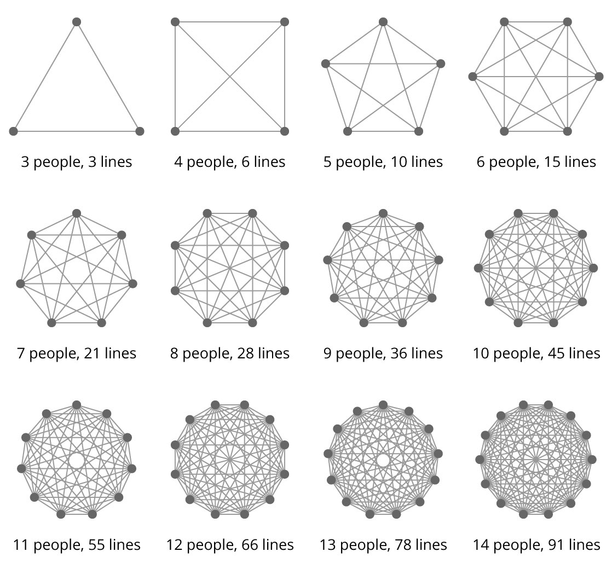

## Learnings

* [More on why agile / XP so often fails heterogenous teams](why-agile-xp-so-often-fails-heterogenous-teams-sarah-mei.md) by Sarah Mei
* [REST: I don't Think it Means What You Think it Does](REST-I-dont-think-it-means-what-you-think-it-does-stefan-tilkov.md) by Stefan Tilkov
* [Growing your software](growing-your-software-rich-hickey.md) by Rich Hickey
* [Why architects fail](why-architects-fail-tilkov.md) by Stefan Tilkov
* [Sparked: How To Discover What Lights You Up And Then Build Your Life Around It](./wds/2017/Sparked-How-To-Discover-What-Lights-You-Up-And-Then-Build-Your-Life-Around-It-Jonathan-Fields.md) by Jonathan Fields
* [How To Tell Captivating Stories](./wds/2017/how-to-tell-captivating-stories-marsha-shandur.md) by Marsha Shandur
* [The Seven Hidden Drivers of Success](.wds/2018/The-Seven-Hidden-Drivers-Of-Success-Jonathan-Fields.md) by Jonathan Fields

## Professional oriented musings

* [Day To Day](https://medium.com/@charlieo/day-to-day-63e610719584)
* [Heart, Tree, Star](https://medium.com/@charlieo/heart-tree-star-a3af328700c2)
* [The Six Fs](https://medium.com/@charlieo/the-six-fs-fd6a87218d12)

## Personal writings

* [Grandma Bessie, The Selectric and Kitchins](https://medium.com/@charlieo/grandma-bessie-the-selectric-and-kitchins-c2721ecf79d8)
* [Summer Walk](https://medium.com/@charlieo/summer-walk-6382707a03d0)
* [Small Batch Artisan Southern Sweet Iced Tea](https://medium.com/@charlieo/small-batch-artisan-southern-sweet-iced-tea-9fe51b213826)
* [Untitled](https://medium.com/@charlieo/i-am-gay-i-am-queer-283101d3e0f)

---

Please note that this project is released with a [Contributor Code of Conduct](./code-of-conduct.md). By participating in this project you agree to abide by its terms. Learn more at [https://www.contributor-covenant.org/](https://www.contributor-covenant.org/).
