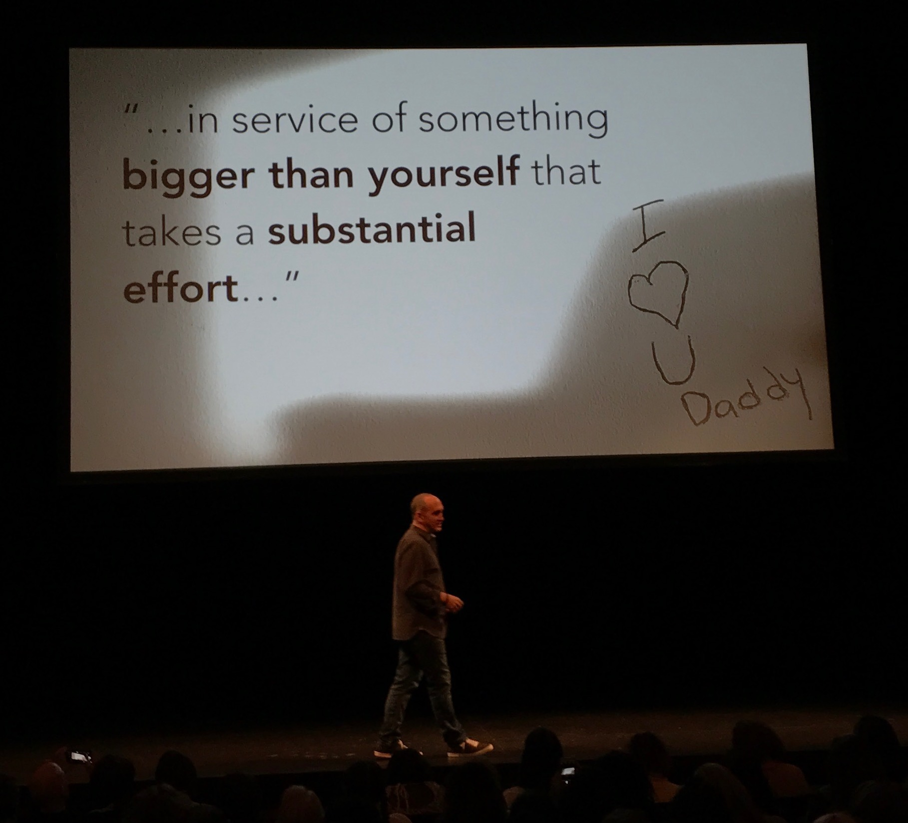
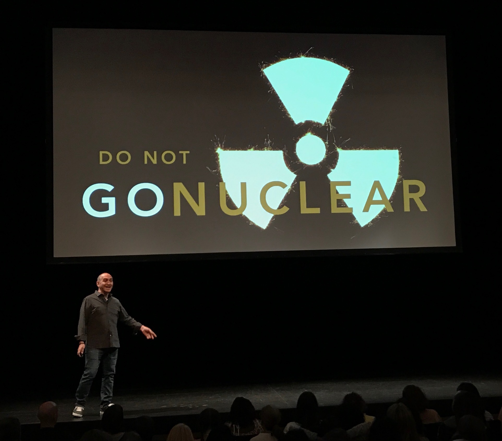
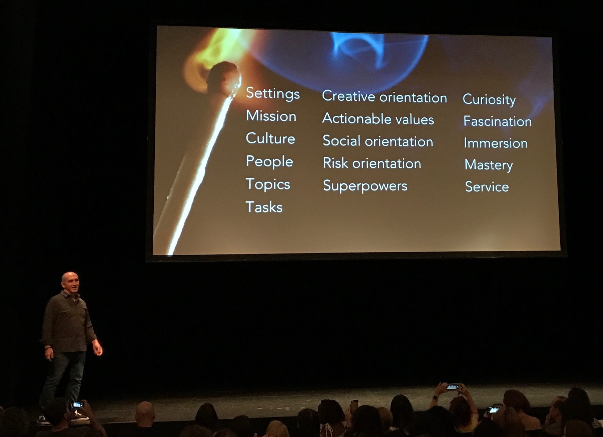
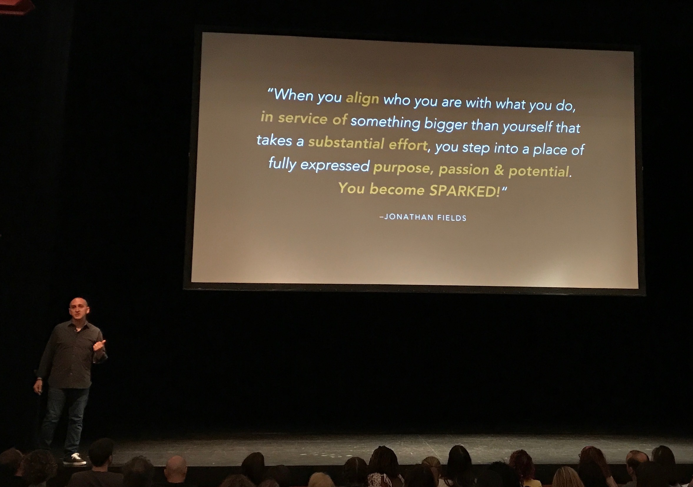
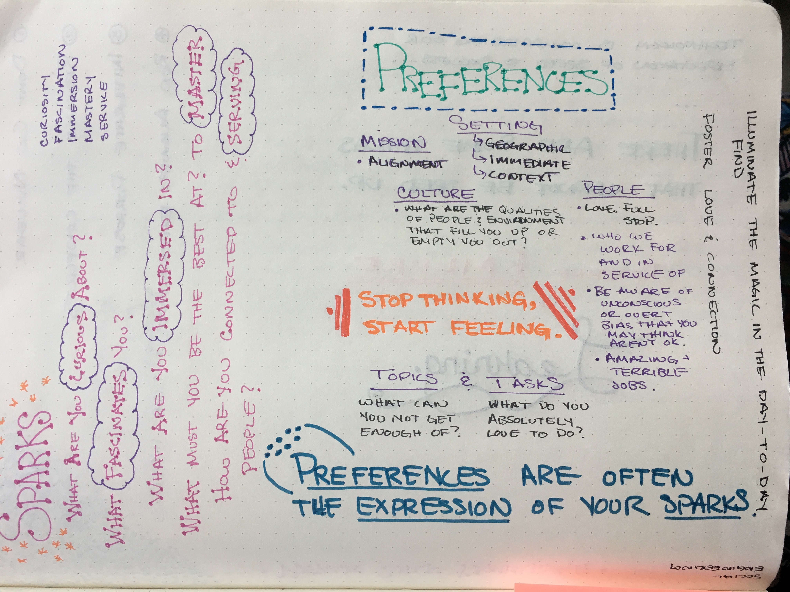
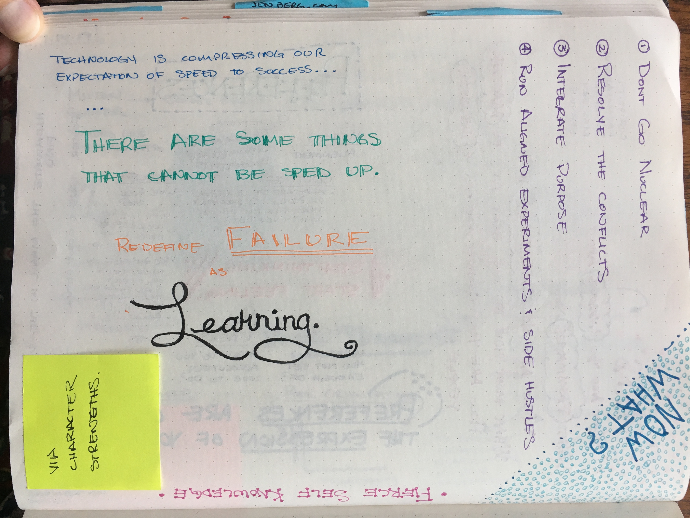
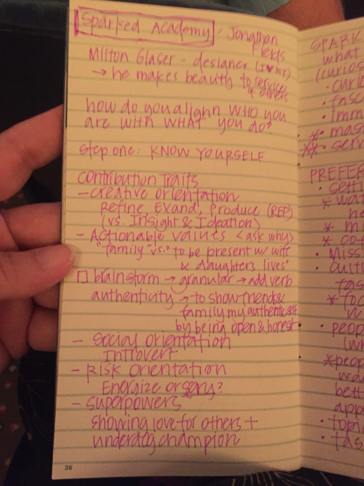
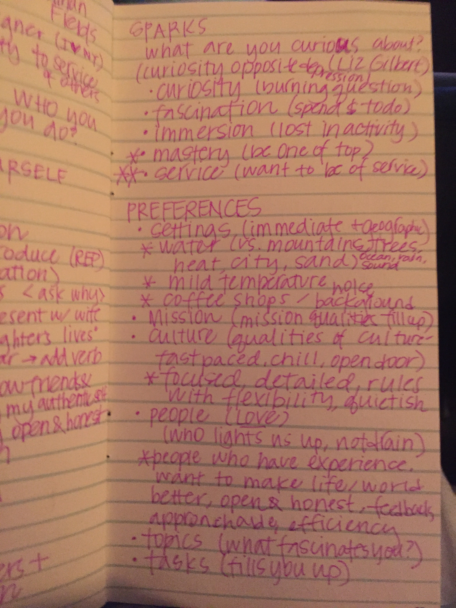
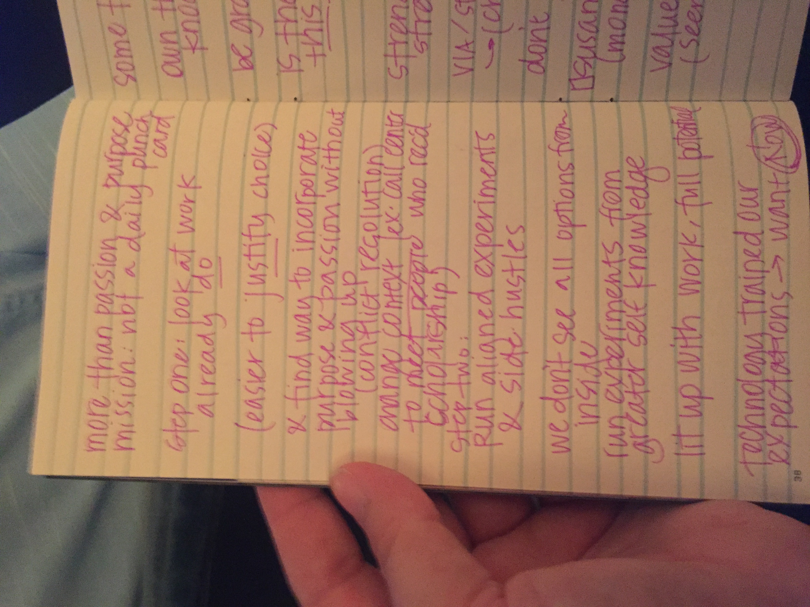
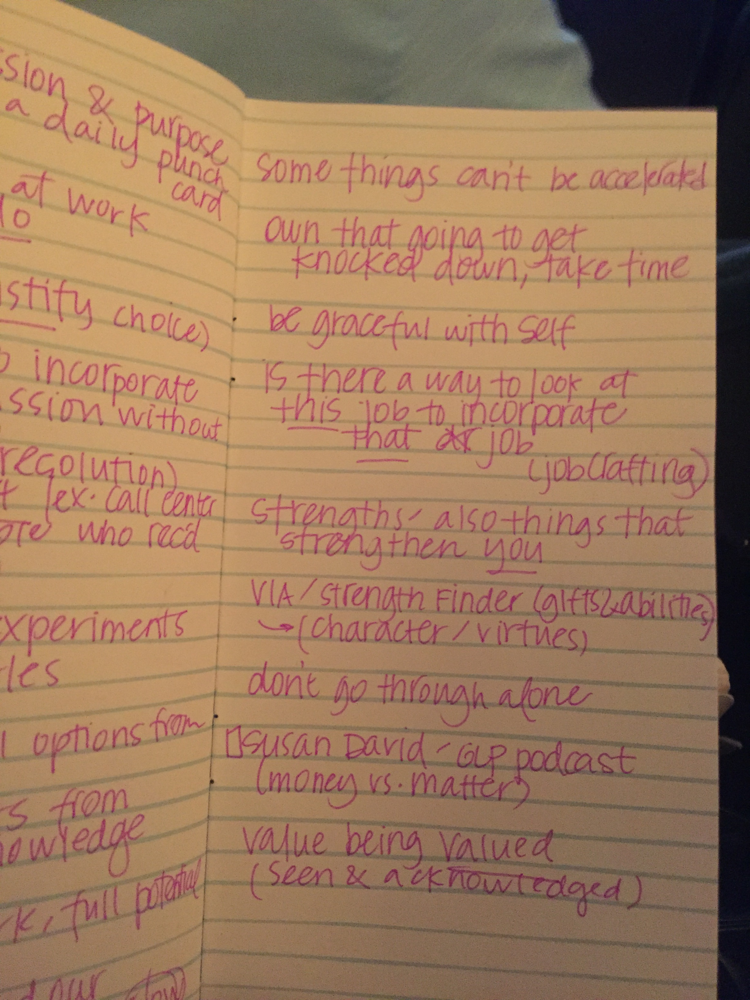

# Sparked: How To Discover What Lights You Up And Then Build Your Life Around It

[Jonathan Fields](http://www.jonathanfields.com/)

[World Domination Summit 2017](https://worlddominationsummit.com/)

[Milton Glaser](https://en.wikipedia.org/wiki/Milton_Glaser), I ❤️ NY designer: "It was like the stigmata" at five years old. He knew he was here to make beauty in service to others. [https://www.youtube.com/watch?v=JD1bcGwa3QQ](https://www.youtube.com/watch?v=JD1bcGwa3QQ)

1 in 100 have had a similar experience.

The mythology of career is a lightning bolt and the world lifts them up as the example.

> "When you align who you are with what you do, in service of something bigger than yourself that takes a substantial effort, you step into a place of fully expressed purpose, passion and potential. You become SPARKED!" ~Jonathan Fields

How do you align WHO you are with WHAT you do?

* We focus on domain knowledge in schools.
* We don't teach how to know yourself.

## Step One: Know Yourself

* What is important to you?
* The problem is not knowing what to do but knowing who we are.
* Everything boils down to "I don't want to die."

### Contribution Traits

### Creative Orientation

* Insight and Ideation - You love creating something from nothing.
* Refine, expand, produce (REP).

### Actionable Values

* Ask 'why?'.
* We need to take the words and add a verb and get more specific.
* Brainstorm -> Granular -> Add Verb
* "Family" value example:
  * Define as wife + daughter.
  * "To be present in the lives of my wife and daughter" vs. "to provide a stable financial outcome for my wife and daughter."
* JW example of authenticity: "To show friends and family my authentic self by being open and honest."
* JB: "Illuminate / find the magic in the day-to-day."
* JB: "Foster love and connection."

* Answer in the here and now.

### Social Orientation

* Introvert and Extrovert
* What fills you up?
* What gives us energy?
* What destroys us?

### Risk Orientation

* Are you super comfortable with taking big risks or do they destroy you?

### Superpowers

* It may not bring you joy.
* JW example: "Showing love for others and underdog champion."

### Me

* Create the tribe I want to have.
  * J + N + C + ?
* Invest in knowing myself by taking at least an hour each day for me.
* Extrovert / Ambivert
* Superpowers: Meta, Longevity / Grit

## Step Two: Sparks

### Curiosity

* What are you curious about?
* The opposite of depression is curiosity.
  * Note: This was attributed to Liz Gilbert but I cannot find any reference to the statement online -- this is the closest I could find: https://onbeing.org/programs/elizabeth-gilbert-choosing-curiosity-over-fear/
* Do you have a burning question or problem to solve?

### Fascination

* You latch on to a topic and go deep and don't want to stop.

### Immersion

* When you are doing this thing you lose a sense of time and self.
* You get lost in the activity.

### Mastery

* I want to be as good as I can possibly be, perhaps even the best in the world. I have a quest for growth.

### Service

* You want to be connected and serving people - you want to know you are helping.

## Step 3: Preferences

### Settings

* Immediate
* Geographical
  * Water vs. mountains / trees.
  * Hot vs. cold.
  * City vs. country.
  * Sand vs. dirt.
  * Noisy vs. quiet vs. background.
* Your location makes a huge difference in how you have success in navigating the world.
* It actually matters.
* What are the qualities of those things that light me up?
* There is a relationship between the type of work you are doing and where you best do that work.

### Mission

* Are you working on the things you fine are fiercely aligned with your values?

### Culture

* What are the qualities of the people environment that fill you up or empty you out?
* Doors open or doors closed?
* Frenetic or chill?
* Kambucha or scotch or both?
* When we work in a culture that bolsters us: great. Otherwise: destruction.
* CO: Chill, introspective, contemplative, freedom, inclusive and purposeful. Trust and self-reliance.
* JW: Focused, detailed, rules with flexibility, quiet-ish.

### People

* Love, full stop.
* How are you going to contribute to the world?
* Who we work for, with and in service of is hugely important.
* Overt or unconscious bias which we think is not OK.
* What are the qualities that fill you up or empty you out?
* Was there something about the people at your best / worst job?
* JW: People who have experience, want to make life / world better, open and honest, feedback, approachable and efficiency.

```
                     |------------|
                     |    For     |
                     |------------|
                           |
                           |
|------------|       |------------|       |------------|
|    With    |-------|     Me     |-------| Service Of |
|------------|       |------------|       |------------|
```

### Topics

* What fascinates you?
* What can you not get enough of?

### Tasks

* What do you do with the topics?
* When you are doing it: The funnest thing in the world.
* What do you absolutely love to do?
* CO: "It's the process of making that lights me up rather than the end result.""

Differences in these are often the expression of your sparks: Settings, Mission, Culture, People, Topics, Tasks

## Purpose



> "...in service of something **bigger than yourself** that takes a **substantial effort**..."

* When the thing you are doing is more than a punchlist and is a substantial undertaking.
* More than passion and purpose.
* No need to identify a singular life purpose: You can have many.

**Do not go nuclear.**



### Step One: Look at the work you already do.

* Find ways to incorporate purpose and passion without blowing up.
* The worse you can make your current situation the easier it is to justify blowing it all up.
* What if you works towards something bigger and resolve the conflicts or add more purpose?
* How can I extend beyond my job description?
* Change the context.
  * Example of people working in a call center who received scholarships.
* Redefine failure as learning.

### Step Two: Run aligned experiments and side hustles.

* We don't see all options from inside.
* Run experiments from greater self knowledge.

## Realize technology has trained our expectations.

* Wan't NOW.
* Technology is compressing our expectation of speed to success.
* Some things can't be accelerated.
* Own that we are going to get knocked down, things will take time.
* Be graceful with self.

## Now what? Next steps.

* Is there a way to look at THIS job to incorporate THAT job aka 'job crafting'.
* Strengths - also things that strengthen you.
* VIA Character Strengths / Strength finder / Gifts and abilities
  * Character / virtues
* Don't go through alone.
* Value being valued.
  * Seen and acknowledged.

Susan David: GLP Podcast Money vs. Matter: http://www.goodlifeproject.com/susan-david/



```
Preferences   Contribution Traits      Sparks
Settings      Creative orientation     Curiosity
Mission       Actionable values        Fascination
Culture       Social orientation       Immersion
People        Risk orientation         Mastery
Topics        Superpowers              Service
Tasks
```



"When you align who you are with what you do, in service of something bigger than yourself that takes a substantial effort, you step into a place of fully expressed purpose, passion and potential. You become SPARKED!" ~Jonathan Fields

# Contributing Notes







