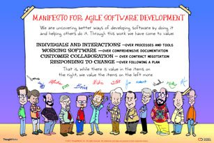
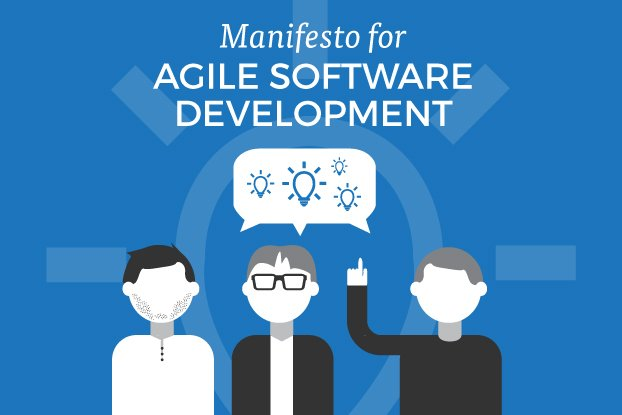
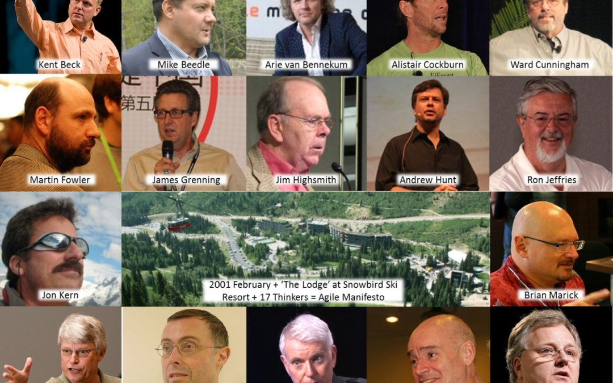
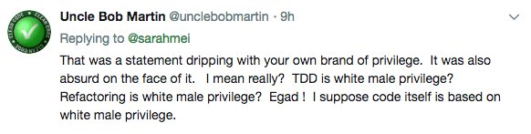

# More on why agile / XP so often fails heterogenous teams

by Sarah Mei
with props to Betsy Haibel

> Note fron @retrosight: I thought this was absolutely brilliant and what I've experienced being an emotionally driven relationship person working in tech software companies. Note: I'm very much a white dude with privilege and I very much endorse this message.

# Foreword

[https://twitter.com/betsythemuffin/status/990568867683500034](https://twitter.com/betsythemuffin/status/990568867683500034)

Remember that traditional Agile/XP/etc practices assume a homogeneous environment.

Indeed, the communication and mentorship patterns they rest on can only emerge organically from homogeneity.

(And then come to @PearConf to rant about this with meeeeeee.)

[https://twitter.com/sarahmei/status/990594488052559874](https://twitter.com/sarahmei/status/990594488052559874)

Wondering why all the agile/XP stuff (like pairing, TDD, etc) doesn’t seem to work for a heterogenous team?

It’s because they were developed by a bunch of white dudes. The practices  assume the practitioners all have A LOT of built-in privilege.

[https://twitter.com/sarahmei/status/990968833547497472](https://twitter.com/sarahmei/status/990968833547497472)

When I first did real (small-a) agile, at @pivotallabs circa 2009, it was clear to me almost immediately that this was the most powerful way to build software that I’d ever participated in.

Pivotal wasn’t a brand so much at that point, and agile hadn’t “won.” I frequently had to explain, discuss, and (ultimately) defend the practices to many of the client developers on my early projects.

By the time I left Pivotal circa 2012, agile had crossed the chasm. Client developers no longer pushed back against the practices - and hadn’t for years, actually.

What practices are we talking about? 100% pair programming. 100% TDD. One week iterations. Daily pair rotation. Standups every day. Planning meetings and retrospectives once a week. And a fixed 9-6 weekday-only schedule to avoid burnout.

Pivotal took a page directly from the XP (eXtreme Programming) workbook. Their CEO, Rob Mee, had worked with some of the signatories on early agile projects, and had been putting it all into practice continuously since then.

I *loved* working like this. Agile is basically a set of attention hacks for me. For example - when I’m pairing I’m not on Twitter or email - all I’m thinking about is the problem at hand. Devs at Pivotal paired 8 hours every weekday, modulo standups, planning meetings, & retros.

I’d never worked in a way that seemed so likely to produce the _right_ product. That’s the motivator for me - building things that are useful and get used. I’m not motivated by the act of writing code (tedious, error prone) nor by new technology (unless the payoff is clear).

The agile/XP/Pivotal way of working is not without its issues.

But the positives were so strong, relative to my previous experience, that it took me 5 years doing full-on agile to even start to see & articulate & connect the problems.

So let’s start with the obvious issues:

* Very few people can pair that much. My job was essentially talking for 8 hours a day.
* Many people can’t do a 9-6 fixed schedule. Parents, in particular, because no daycare place stays open past 6. This is ultimately why I left Pivotal.
* Many people have motivators that don’t mesh well with this system, including pushing frontiers via  research-y code, being in solo ‘flow,’ & using new technology.
* Full-time pairing is hard across time zones. Having everyone in the same time zone is often unrealistic.

That’s the obvious stuff. Most of it can be solved by employing small-a agile, rather than a program like scrum or XP, so that the process adapts to the needs of the team.

The way I usually approach this is to have folks articulate what they’re trying to get out of a practice that’s not working for them. Then we brainstorm other practices that might have the same effect AND work better for that group.

I’ll give you a quick example.

When people do pair programming, their goals are usually some subset of these:

* focus
* avoiding silos
* code review
* onboarding
* cross-training
* fewer rabbit holes

There are other ways to get all those things.

So far, these are just the garden-variety problems with agile adoption that everyone’s been talking about for years. Let’s move on to the less-obvious problems.

To find agile's non-obvious problems, so we can start to see why heterogenous teams have trouble, let's take a peek underneath the surface of the obvious problems.

Let's start with "very few people can pair that much."

For many years, I was a pair programming evangelist. Between that & my consulting work, I've met lots of people who tried pair programming and hated it. Some of them had paired for months, with different people, on different schedules, & still couldn't find a modality they liked.

These people came from many different genders & races. Some were introverted; some weren't. What they all had in common wasn't obvious to me for a long time...until recently, it was.

They're all usually on the downward side of one or _power dynamics_ in their pairs.

Power dynamics in pairing is a subject that rarely comes up, at either the macro (community discussion) or micro (team discussion) levels. First let's talk about what a power dynamic is, and then we can look at how it manifests in a pair.

A power dynamic is behavior in an interaction driven by a hierarchical relationship between the participants. This hierarchical relationship can be formal (manager-report, or senior-junior) but  often is informal (based on race, gender, background, etc.).

Informal power dynamics based on characteristics that have historically been subject to structural oppression turn around & mimic that structural hierarchy. Men are  powerful than other genders; white people are  powerful than other races. And so forth.

Note that " powerful" in this context doesn't mean any kind of formal power; men are not officially  powerful than other genders.

The power I'm talking about here is simply the power to _ignore the dynamic completely_.

People on the upward side of a power dynamic are free to pretend the dynamic doesn't exist, and indeed, many times as children they're told that that's what they should do. "Don't see color! Don't see gender!"

Even as adults, we get messages that sometimes suggest ignoring power dynamics is the right way to go. For example, I often see women asking men to treat them the same way that they, the men, treat other men at work.

The trouble with ignoring a power dynamic when you're on the upward side is that in doing so, you _reinforce_ the dynamic, even though in many situations (like pair programming) neutralizing it would be better.

That's because from the upward side, you need to take real action to level the playing field. Due to the inherent nature of these power dynamics, folks on the upward side have do it. They are  powerful & better resourced, and IMO it is their moral responsibility.

When you're on the upward side of a power imbalance & you want to level the field, ignoring (or denying) the tilt doesn't work. And if you place the burden on the downward side folks, you're asking them to both walk uphill AND figure out how to distribute power they don't have.

Now in any given pair of people, multiple power dynamics are in play, and figuring out who is "most powerful" is not only pointless - it's impossible. You can't just sum them. Just like with oppression generally (of which this is a tiny piece), power dynamics are intersectional.

Common power dynamics in play in a pair programming situation (low - high):

* junior - senior
* "wrong" background - "right" background
* learning developer - teaching developer
* feminine - masculine
* people of color - white folks
* women & other genders - men

As a white person, I think it sucks that the race dynamic that I'm on the upward side of exists, and I want to neutralize it as best I can. That means I need to actively work against it.

But say I'm pairing with a black man who is technically expert in the problem we're working on. Do these power dynamics cancel each other out? Can we go back to ignoring?

Nope. As you may have figured out by now, power dynamics are something EVERYONE has to keep in mind.

They are, as the name suggests, dynamic. They shift and mutate and change in prominence, often even over the course of one interaction.

Three questions remain:

* What does "keeping them in mind" mean?
* How do we neutralize the ones we're on the upper side of?
* What does this have to do with homogeneity in agile? (I promise we're getting there)

People who are on the upward side of a power dynamic often don't even notice it's there. Even  concerning is the fact that if they've been conditioned to think the playing field is already level (i.e., a 'meritocracy') then they'll often deny any such tilt exists.

These denials are internalized often even by the folks who are running uphill. The place where you can see the tilt of the field is in broad statistical surveys: the pay gap. The wealth gap. Corporate diversity numbers. Promotion statistics. Glass ceilings & cliffs.

That's the macro level. At the micro level, keeping these dynamics in mind and trying to neutralize the ones you're on the upward side of is a tricky and complicated skill. Here are a few rubrics I've used over the years, that may help you get started:

**1. The  dynamics you're on the upward side of, the  you take cues from your pair.**

Let them speak first. Be mindful of interrupting. Catch your reactions to their words on the way out, & do a post-processing pass to consider whether your reaction is due to the dynamic.

**2. Think ahead of time of what dynamics might exist, and think carefully about where you are relative to each other in those dynamics.**

The list above is a good start, but there are many others: national origin, native language, external signs of religion, editor preference...

(Seriously - the textual editor folks [vim, emacs, etc.] constantly place themselves above IDE users.)

There's also preferred language (woe be to you as a PHP developer coming into a shop that does basically anything else), & location in the stack (HTML/CSS is less prestigious).

There's also role - developers tend to place themselves above designers, for example, which means as a dev, even if you don't think designers are less-than, when you're pairing with a designer you should be mindful of that dynamic.

**3. When your pair doesn't reciprocate (i.e., talks over you, thinks their way is always correct, has reactions that would be different with someone else), one way to neutralize that is to demonstrate a power dynamic where you're on the upward side, & they're on the downward side.**

This avenue isn't always available, though - there may legitimately be no power dynamics that work that way, or there may be no way to demonstrate them. And now we come to why this practice is hard with a heterogenous team.

Pairing has nothing to say about how to structure an interaction to avoid taking unfair advantage of power dynamics. One of its basic assumptions is that everyone feels empowered to contribute.

When this is true, pairing is amazing. When it's not, it's a nightmare.

Now ask yourself, who is it who always feels empowered to contribute? Who sees no need for further structure the mitigate the effects of power dynamics? Who, indeed, is most likely to deny such power dynamics even exist?

A group of cartoon white men standing under a banner with the Agile Manifesto written on it.

An illustration of three white men with "Manifesto for Agile Software Development" written above them.

The photo that appears behind one of the first incarnations of the Agile Manifesto, showing a bunch of white men around a whiteboard.

A composite image of 17 of the signatories of the agile manifesto - all white men.

At the micro level, pair programming can work as a practice on a heterogenous team - as long as you put in place further structure to mitigate the effects of these interpersonal power dynamics. But at the macro level, this is a fatal flaw.

Because without further structure, the folks on the downside of those dynamics when they pair program feel constantly watched, judged, and steamrolled. No wonder they quit. No wonder I was only woman #2 out of 45 developers at Pivotal SF when I joined (& the other was an intern).

They'd had women developers before, but they had all quit. I managed to stay, because pairing worked really well with my brain, and because I derived some power from my public presence that caused most men to reconsider how they worked with me.

That's how pair programming fails heterogenous teams - by making assumptions that are really only true for people very similar to the practice's originators.

And then, of course, by having the originators EVEN TODAY deny that agile's assumptions aren't true for everyone.🙄

For every practice, there's a long story like this. People pushed back hardest yesterday on TDD - could driving your code with tests possibly be related to power dynamics?

_Spoiler alert: YES 😅_

One reason people like TDD is that you end up with a very nice set of self-documenting tests. Sounds great, right?

But who exactly is this "self"? Not everyone understand code the same way. There are always assumptions built into this "self-documentation" about how the developer writing them wants to be communicated to.

My tests, for example, tend to start at the outside ("what happens if you just call this method with no arguments?") and work their way cyclically inside, towards the specific functionality I'm driving out.

Over the years, many men I've paired with have wanted to jump right into the specifics, and put all the other stuff at the bottom. They resist starting with what, eventually, is likely an error case.

They argue that people expect the basic functionality to be at the top, like in a README. For me, however, I'd rather read the whole thing like a document, and understand the journey. I want a narrative. They want bullet points.

This is a classically gendered split. Not every man wants bullet points, and not every woman wants a narrative, but statistically this split exists everywhere - in literature, in scientific writing, even in journalism.

So who's right? Neither of us, fully.

But which is the standard form? The one men have an easier time with.

Another aspect of TDD that is often emphasized is that this lets you write code "the right way," i.e., with tests, high quality, etc. How could that possibly be related to power dynamics? 🤔

I'm glad you asked! It's well-established that men taking the time to do things "the right way" are perceived as skilled, while women taking the time to do things "the right way" are perceived as incompetent (taking extra time for a simple task).

In fact, current research suggests that this tendency travels across all the power dynamics - race, experience level, etc.

But when the originators of this practice came up with it, they didn't need to think about that, because they were all white men. There was no difference in how taking extra time to do it right was perceived.

Neither the specific practice of TDD, nor the agile philosophy behind it, says anything about how to counter this perception. So people on the downward side fo the dynamics feel (correctly) that they're trying to do the right thing but their contributions aren't as valued.

Again - white men can be completely ignorant of this dynamic, since it doesn't affect them. When other people point it out, they often say something along the lines of "you're making that up" or "you're covering for your own incompetence."

(See also: my mentions. Lots of "stop making excuses" ridiculousness. They don't particularly bother me, because I know I can run circles around any of them. But when I was less confident, earlier in my career, I would have believed them.)

A heterogenous team gives you something critical - experience on the downward side of important power dynamics. Provided they have good management, such a team can construct practices and process and software that doesn't make the same assumptions of homogeneity.

But that's not where agile came from, nor eXtreme Programming. They came from homogenous teams composed of individuals largely on the upward side of important power dynamics.

We don't need to totally bin them, but we do need to reimagine them.

That's all I have to say right now, but know that every single agile practice has something like this behind it.

I'll close with some reactions to my initial foray into this, which all explicitly or implicitly say I'm fabricating these differences (which science confirms):

There were some constructive responses as well, asking for more detail, and that's why I wrote this thread. For the other folks, who all want to keep existing systematic discrimination because they know they can't compete on a level playing field:

EOF
